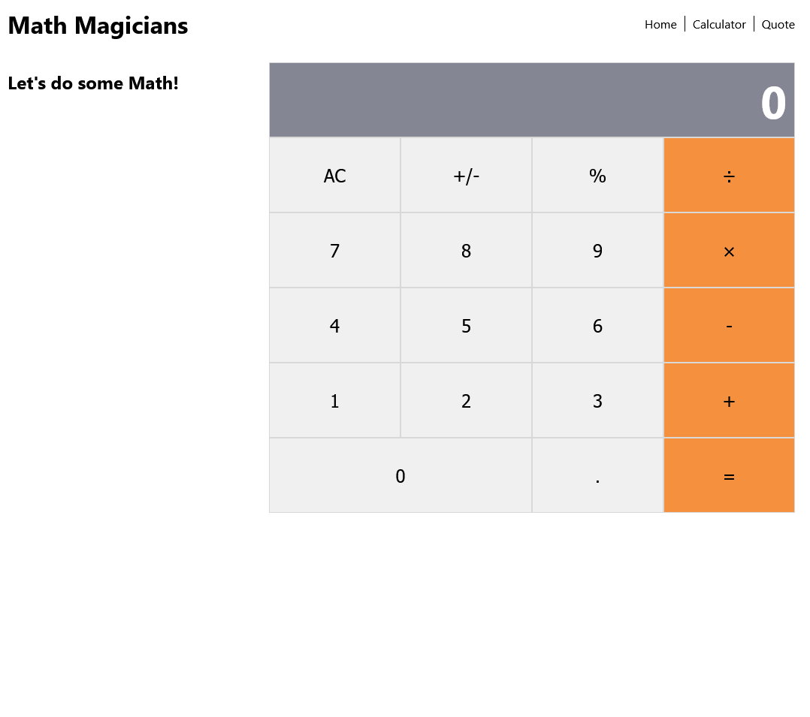

# Math Magicians Website (with Calculator App)

> Small Webpage containing a Home page, and a Calculator App.

The site consists of 3 pages:
- Home
- Calculator
- Quote

It uses Routes to render the different pages.
The calculator does the basic operations:
- Addition
- Subtraction
- Multiplication
- Division
- Percentage

It is tested using jest.

## Built With

- JavaScript, HTML, CSS
- React
- Babel, Eslint, Stylelint.

## Live Demo

[Live Demo Link](https://calculator-app-jpdf00.herokuapp.com/)

## Getting Started

To get a local copy up and running follow these simple example steps.

- On the top of the page there is a green button name "Code"
- Click on the "Code" button.
- A Menu will appear click in "Download Zip"
- Save the zip file on your computer.
- Extract the contents of the zip you just downloaded into a folder.

### Prerequisites

- nodeJS.
- A browser.

### Setup

- Open your comand prompt.
- Go inside the folder you extracted from the zip file.
- Type `npm install`.

### Usage

- Open your comand prompt.
- Go inside the folder you extracted from the zip file.
- Type `npm start` (this should open a page in your default browser and the page should load).

### Run tests

- Open your comand prompt.
- Go inside the folder you extracted from the zip file.
- Type `npm run test`.

## Authors

👤 **João Paulo Dias França**

- GitHub: [@jpdf00](https://github.com/jpdf00)
- Twitter: [@jpdf00](https://twitter.com/jpdf00)
- LinkedIn: [João Paulo Dias França](https://www.linkedin.com/in/jpdf00/)

## 🤝 Contributing

Contributions, issues, and feature requests are welcome!

Feel free to check the [issues page](https://github.com/jpdf00/calculator-app/issues).

## Show your support

Give a ⭐️ if you like this project!

## 📝 License

This project is [MIT](./LICENSE) licensed.
